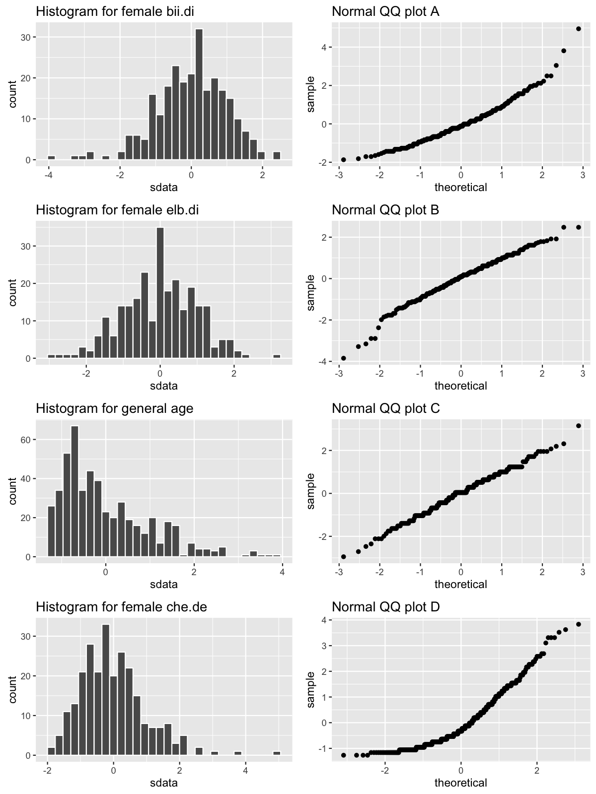

```{r echo = FALSE}
knitr::opts_chunk$set(eval = TRUE, message = FALSE, warning = FALSE)
```

**Load data**

```{r load-data}
library(dplyr)
library(ggplot2)
library(oilabs)
data(bdims)
head(bdims)
```

```{r male-female}
mdims <- bdims %>%
  filter(sex == "m")
fdims <- bdims %>%
  filter(sex == "f")
```

1.  Make a histogram of men's heights and a histogram of women's heights.  How 
    would you compare the various aspects of the two distributions?
    
```{r ex1}
qplot(x = hgt, data = mdims, geom = "histogram", col = I("white"), main = "Distribution of male heights")
qplot(x = hgt, data = fdims, geom = "histogram", col = I("white"), main = "Distribution of female heights")
```

*The shape of the two distributions are quite similar: both male and female heights
show a symmetric and unimodal distribution (the multiple modes here are best thought
of as a result of sampling variability and a small binwidth). The spread of the two
distributions is also similar, with most of the observations falling within an interval spanning
~25 cm. They differ most notably in their centers, with a mean/median/mode of ~178 cm
and ~165 cm for men and women, respectively.*


```{r female-hgt-mean-sd, include=FALSE}
fhgtmean <- mean(fdims$hgt)
fhgtsd   <- sd(fdims$hgt)
```

```{r hist-height, include=FALSE}
qplot(x = hgt, data = fdims, geom = "blank") +
  geom_histogram(aes(y = ..density..), bins = 20, col = I("white")) +
  stat_function(fun = dnorm, args = c(mean = fhgtmean, sd = fhgtsd), col = "tomato")
```

2.  Based on the this plot, does it appear that the data follow a nearly normal 
    distribution?
    
*It's difficult to tell. The histogram is vaguely bell-shaped, but it a higher
concentration than the normal in the middle of the distribution. This is likely
due to sampling variability, so the normal curve seems like a reasonable
approximation.*

```{r sim-norm}
sim_norm <- rnorm(n = length(fdims$hgt), mean = fhgtmean, sd = fhgtsd)
```


3.  Make a normal probability plot of `sim_norm`.  Do all of the points fall on 
    the line?  How does this plot compare to the probability plot for the real 
    data?

```{r ex3}
qplot(sample = sim_norm) + stat_qq()
```

*The points don't fall exactly on a line, but they're quite close. The largest
deviations come in the tail of the distribution. This simulated plot is more 
smoothly linear than the data, but that is likely due to a discretization in
the data*.


```{r qqnormsim}
qqnormsim(sample = hgt, data = fdims)
```

4.  Does the normal probability plot for female heights look similar to the plots 
    created for the simulated data?  That is, do plots provide evidence that the
    female heights are nearly normal?
    
*The Q-Q plot for female heights is strikingly similar to that from simulated
normal data sets. In fact, several of the simulated plots show a greater deviation
from linearity in the tails that does the original data. Again, the main difference
is that the data has a stair-step shape.*


5.  Using the same technique, determine whether or not female weights appear to 
    come from a normal distribution.
    
```{r ex5}
qqnormsim(sample = wgt, data = fdims)
```

*The normal approximation appears to be less appropriate for `wgt` than for `hgt`.
This data shows some curvature in the shape of the qqplot that suggests a longer
right tail that we'd expect from nearly normal data and also shows two notable
outliers.*

6.  Write out two probability questions that you would like to answer; one 
    regarding female heights and one regarding female weights.  Calculate the 
    those probabilities using both the theoretical normal distribution as well 
    as the empirical distribution (four probabilities in all).  Which variable,
    height or weight, had a closer agreement between the two methods?

*Answers will vary here. The important thing is to use `pnorm` to find the area
under the curve to the Left of a value and use `sum(data meeting condition) / length(data)`
to find the empirical probabilities.*

* * *

## On Your Own

-   Now let's consider some of the other variables in the body dimensions data 
    set.  Using the figures at the end of the exercises, match the histogram to 
    its normal probability plot.  All of the variables have been standardized 
    (first subtract the mean, then divide by the standard deviation), so the 
    units won't be of any help.  If you are uncertain based on these figures, 
    generate the plots in R to check.

    **a.** The histogram for female biiliac (pelvic) diameter (`bii.di`) belongs
    to normal probability plot letter B.

    **b.** The histogram for female elbow diameter (`elb.di`) belongs to normal 
    probability plot letter C.

    **c.** The histogram for general age (`age`) belongs to normal probability 
    plot letter D.

    **d.** The histogram for female chest depth (`che.de`) belongs to normal 
    probability plot letter A.

-   Note that normal probability plots C and D have a slight stepwise pattern.  
    Why do you think this is the case?

*This is likely due to the discrete scale on which the data was measured. When
people report their age, they usually only provide integer values, not ages like
28.3746 years. This is what creates the step pattern in the variable on the y-axis 
of the qqplot. The x-axis refers to the percentiles of the normal distribution, 
which is continuous, so the plots are continuous in their x-values.*

-   As you can see, normal probability plots can be used both to assess 
    normality and visualize skewness.  Make a normal probability plot for female 
    knee diameter (`kne.di`).  Based on this normal probability plot, is this 
    variable left skewed, symmetric, or right skewed?  Use a histogram to confirm 
    your findings.
    
    
```{r oyo3}
qplot(sample = kne.di, data = fdims, stat = "qq")
```

*It is very clear that the normal curve would be a poor approximation to female
knee diameter. The Q-Q plot shows strong deviations from linearity in the right tail,
suggesting that it's longer (right-skewed) than we'd expect under the normal distribution. We
can verify this by looking at the histogram.*

```{r}
qplot(x = kne.di, data = fdims, col = I("white"), geom = "histogram")
```


```{r hists-and-qqs, include=FALSE}
sdata <- fdims %>%
  mutate(sdata = (bii.di - mean(bii.di))/sd(bii.di)) %>%
  select(sdata)
p1 <- ggplot(sdata, aes(x = sdata)) +
  geom_histogram(col = "white") + 
  ggtitle("Histogram for female bii.di")
p4 <- qplot(sample = sdata, data = sdata) +
  ggtitle("Normal QQ plot B")
sdata <- fdims %>%
  mutate(sdata = (elb.di - mean(elb.di))/sd(elb.di)) %>%
  select(sdata)
p3 <- ggplot(sdata, aes(x = sdata)) +
  geom_histogram(col = "white") + 
  ggtitle("Histogram for female elb.di")
p6 <- qplot(sample = sdata, data = sdata) +
  ggtitle("Normal QQ plot C")
sdata <- bdims %>%
  mutate(sdata = (age - mean(age))/sd(age)) %>%
  select(sdata)
p5 <- ggplot(sdata, aes(x = sdata)) +
  geom_histogram(col = "white") + 
  ggtitle("Histogram for general age")
p8 <- qplot(sample = sdata, data = sdata) +
  ggtitle("Normal QQ plot D")
sdata <- fdims %>%
  mutate(sdata = (che.de - mean(che.de))/sd(che.de)) %>%
  select(sdata)
p7 <- ggplot(sdata, aes(x = sdata)) +
  geom_histogram(col = "white") + 
  ggtitle("Histogram for female che.de")
p2 <- qplot(sample = sdata, data = sdata) +
  ggtitle("Normal QQ plot A")

multiplot <- function(..., plotlist=NULL, file, cols=1, layout=NULL) {
  library(grid)

  # Make a list from the ... arguments and plotlist
  plots <- c(list(...), plotlist)

  numPlots = length(plots)

  # If layout is NULL, then use 'cols' to determine layout
  if (is.null(layout)) {
    # Make the panel
    # ncol: Number of columns of plots
    # nrow: Number of rows needed, calculated from # of cols
    layout <- matrix(seq(1, cols * ceiling(numPlots/cols)),
                    ncol = cols, nrow = ceiling(numPlots/cols))
  }

 if (numPlots==1) {
    print(plots[[1]])

  } else {
    # Set up the page
    grid.newpage()
    pushViewport(viewport(layout = grid.layout(nrow(layout), ncol(layout))))

    # Make each plot, in the correct location
    for (i in 1:numPlots) {
      # Get the i,j matrix positions of the regions that contain this subplot
      matchidx <- as.data.frame(which(layout == i, arr.ind = TRUE))

      print(plots[[i]], vp = viewport(layout.pos.row = matchidx$row,
                                      layout.pos.col = matchidx$col))
    }
  }
}

png("histQQmatchgg.png", height = 1600, width = 1200, res = 150)
multiplot(p1, p2, p3, p4, p5, p6, p7, p8,
          layout = matrix(1:8, ncol = 2, byrow = TRUE))
dev.off()
```




<div id="license">
This is a product of OpenIntro that is released under a 
[Creative Commons Attribution-ShareAlike 3.0 Unported](http://creativecommons.org/licenses/by-sa/3.0). 
This lab was adapted for OpenIntro by Andrew Bray, Chester Ismay, and Mine &Ccedil;etinkaya-Rundel
from a lab written by Mark Hansen of UCLA Statistics.
</div>
