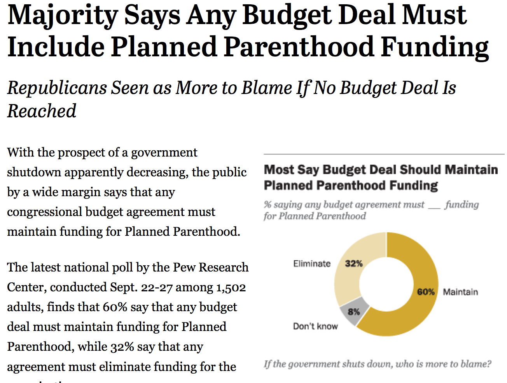
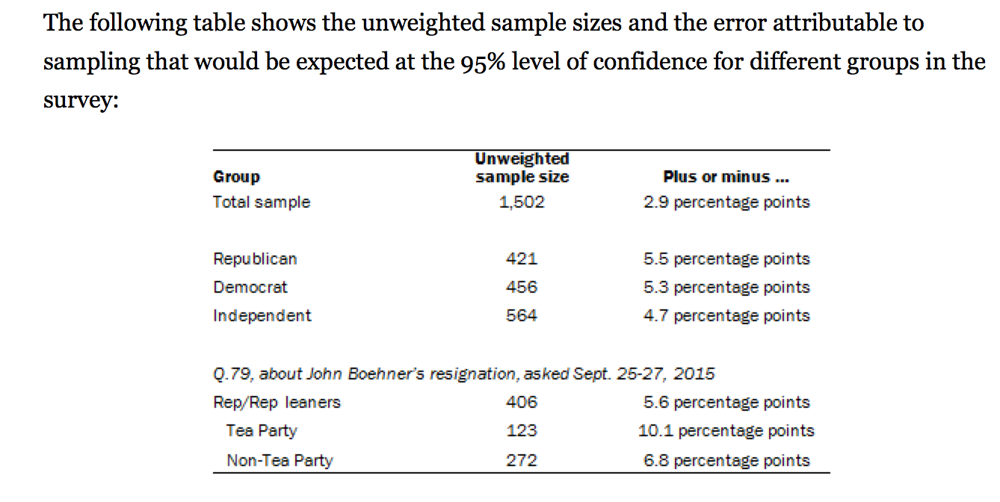

```{r setup, include=FALSE}
library(knitr)
options(digits=2)
knitr::opts_chunk$set(echo = TRUE)
library(dplyr)
library(ggplot2)
```


## What is it good for? {.build}

Hypothesis test have been shown to be valuable contributors to science (p < .05)
but are sometimes abused (p < .05).

Used to assess the degree to which data is consistent with a particular model.

The most widely used tool in statistical inference.


## Step 1 {.build}

Lay out your model(s).

**$H_0$**: null model, business as usual  
**$H_A$**: alternative model, business not as usual

- Hypotheses are statments about the TRUE STATE of the world and should involve
*parameters*, not *statistics*.
- Hypotheses should suggest a *test statistic* that has some bearing on the claim.
- Always use two-tailed tests.


## Step 2 {.build}

Contruct the appropriate null distribution.

```{r, echo=FALSE, eval=TRUE, fig.height=2.5}
x1  <- 0:75
df <- data.frame(x = x1, y = dbinom(x1, 75, 0.5))
qplot(x, y, data = df) + 
  geom_bar(stat = "identity", col = "darkgreen", fill = "white") +
  stat_function(fun = dnorm, args = list(mean = 75/2, sd = sqrt(74/4)), 
                col = "goldenrod", lwd = 1.2)
```

1. Randomization
2. Simulation
3. Exact Probability Theory
4. Normal Approximation


## Step 3 {.build}

Calculate a measure of consistency between the observed test statistic (the data)
and the null distribution (i.e., a p-value).

- If your observed test stat is in the tails > low p-val > data is inconsistent
with null hypothesis > "reject null hypothesis".
- If your observed test stat is in the body > high p-val > data is consistent with
the null hypothesis > "fail to reject the null hypothesis".

What can go wrong?


# Confidence Intervals


## {.flexbox .vcenter .build}

**Confidence Interval**: a plausible range of values for a population parameter.


##
<center>

</center>


##
<center>

</center>


## Construction of a CI {.build}

If the distribution of the point estimate can be well approximated by the Normal:

$$ \textrm{point estimate} \pm \textrm{margin of error} $$
$$ \textrm{point estimate} \pm 1.96 \times SE $$

- *point estimate*: $\hat{p}$, $\bar{x}$
- *standard error (SE)*: standard deviation of the sampling distribution.


## Question

"The proportion of Americans who want to maintain planned parenthood is estimated
to be between 57.1% and 62.9% with 95% confidence." Which of the following interpretations
are reasonable?

1. The interval [.571, .629] provides a plausible range for $\hat{p}$
2. We are certain that the population proportion lies within this interval.
3. If we took many more samples of the same size and computed many $\hat{p}$s and
many CIs, around 95% of those CIs would contain the population proportion.


## {.flexbox .vcenter}

<center>

</center>