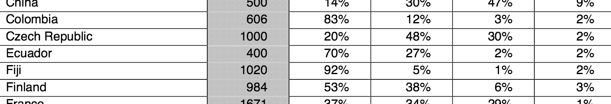

```{r setup, include=FALSE}
library(knitr)
options(digits=3)
knitr::opts_chunk$set(echo = TRUE)
library(dplyr)
library(ggplot2)
library(oilabs)
```


## Checking Conditions{.build}
<center>

</center>

<br />  
  
$\hat{p} \sim N(\mu = p, \sigma = \sqrt{\frac{p(1-p)}{n}})$ if

1. Observations are independent
2. The number of observed successes and failures is more than 10.

$$
np \ge 10 \\
n(1 - p) \ge 10
$$

## Question {.build}

We are given that $n = 1002, \hat{p} = 0.05$. Which of the
below is the correct calculation of the 95% confidence interval?

1. $0.05 \pm 1.96 \sqrt{(.05 \times 0.95)/1002}$
2. $0.05 \pm 1.65 \sqrt{(.05 \times 0.95)/1002}$
3. $0.05 \pm 1.96 ((.05 \times 0.95)/\sqrt{1002})$
4. $50 \pm 1.96 \sqrt{(50 \times 952)/1002}$


## Constructing a CI {.build}

```{r makeus12, echo = FALSE}
us12 <- 
  atheism %>% 
  filter(nationality == "United States" & year == "2012")
```

```{r construct}
n <- length(us12$response)
p_hat <- 50/1002
n * p_hat
SE <- sqrt((p_hat * (1 - p_hat)) / n)
z_star <- qnorm(.025) # for a 95% CI
z_star
MoE <- z_star * SE
c(p_hat - MoE, p_hat + MoE)
```


## {.build}

```{r ciforus, fig.height=2}
inference(y = us12$response, est = "proportion", type = "ci", 
          method = "theoretical", success = "atheist")
```


## `inference()` function {.build}

<center>

</center>

<br/>

Your great responsibility:

1. Understand what's going on inside the black box.
2. Ensure the conditions for inference are reasonable.


## When conditions *aren't* reasonable {.build}

<center>

</center>

$$
n = 400 \\
\hat{p} = 0.02 \\
np = 8 < 10
$$

Are they doing inference?

Yes! "In general, the ..."

<center>

</center>


## Simulate the sampling dist.

```{r ecuador}
p <- 0.02
n <- 400
p_hats <- rep(0, 10000)

for (i in 1:10000) {
  samp <- sample(c("atheist", "non_atheist"), size = n,
                 replace = TRUE, prob = c(p, 1 - p))
  p_hats[i] <- sum(samp == "atheist") / n
}
```


## Simulate the sampling dist.

```{r ecuadorplot, warning = FALSE, message = FALSE, echo = FALSE}
qplot(x = p_hats, geom = "density", adjust = 1.7, ylim = c(0, 60))
```


## A poor approximation

```{r ecuadorplot2, warning = FALSE, message = FALSE, echo = FALSE}
qplot(x = p_hats, geom = "density", adjust = 1.7, ylim = c(0, 60)) +
  stat_function(fun = dnorm, args = c(mean = p, sd = sqrt((p*(1-p))/n)), col = "tomato")
```


## Double the sample size...

```{r ecuador2}
p <- 0.02
n <- 800
p_hats <- rep(0, 10000)

for (i in 1:10000) {
  samp <- sample(c("atheist", "non_atheist"), size = n,
                 replace = TRUE, prob = c(p, 1 - p))
  p_hats[i] <- sum(samp == "atheist") / n
}
```


## A better approximation

```{r ecuadorplot3, warning = FALSE, message = FALSE, echo = FALSE}
qplot(x = p_hats, geom = "density", adjust = 1.7) +
  stat_function(fun = dnorm, args = c(mean = p, sd = sqrt((p*(1-p))/n)), col = "tomato")
```


## Increase p...

```{r ecuador3}
p <- 0.25
n <- 800
p_hats <- rep(0, 10000)

for (i in 1:10000) {
  samp <- sample(c("atheist", "non_atheist"), size = n,
                 replace = TRUE, prob = c(p, 1 - p))
  p_hats[i] <- sum(samp == "atheist") / n
}
```


## A better approximation

```{r ecuadorplot4, warning = FALSE, message = FALSE, echo = FALSE}
qplot(x = p_hats, geom = "density", adjust = 1.7) +
  stat_function(fun = dnorm, args = c(mean = p, sd = sqrt((p*(1-p))/n)), col = "tomato")
```


# Making decisions with confidence intervals


## A reasonable claim? {.build}

*A full 10% of Americans are atheist.*

### Claim
$p = 0.10$

### 95% CI
$(0.0364 , 0.0634)$

The claim is *inconsistent* with our estimate of $p$.

