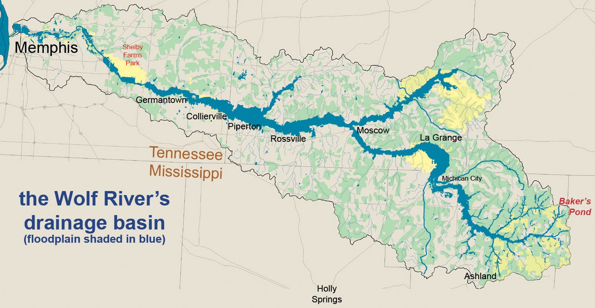
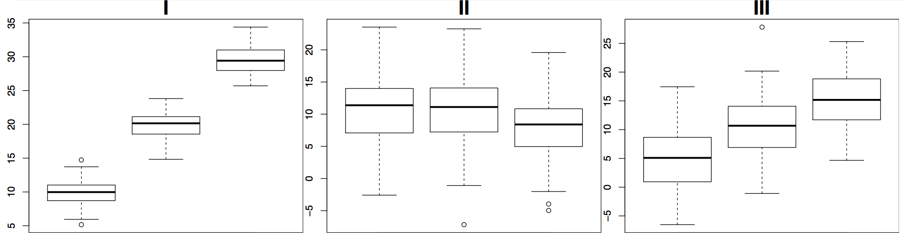

```{r setup, include=FALSE}
library(knitr)
options(digits=3)
knitr::opts_chunk$set(echo = TRUE)
library(dplyr)
library(ggplot2)
library(oilabs)
library(openintro)
```

## IQ and Sex {.build}

```{r echo = FALSE}
# tweak data set to increase dependence
gifted[19, "motheriq"] <- 130
gifted[9, "motheriq"] <- 112
gifted[21, "fatheriq"] <- 120
gifted[4, "fatheriq"] <- 123
gifted[15, "fatheriq"] <- 121
d <- data.frame(IQ = c(gifted$fatheriq, gifted$motheriq),
                sex = rep(c("male", "female"), each = nrow(gifted)))
set.seed(184)
d <- d[sample(1:nrow(d)), ]
head(d)
```

Consider a data set containing the IQs of 36 men and the IQs of 36 women, 
$W \sim X$. Can use this data to test the following?

$$
H_0: \mu_{M} - \mu_{F} = 0 \\
H_A: \mu_{M} - \mu_{F} \ne 0
$$


## {.smaller}

```{r}
(ds <- d %>%
  group_by(sex) %>%
  summarize(mean = mean(IQ),
            s = sd(IQ),
            n = n()))
```


```{r, echo=FALSE, warning=FALSE, message=FALSE, fig.height=3}
#qplot(x = IQ, data = d, geom = "bar", facets = ~ sex, fill = I("linen"), col = I("darkseagreen"))
qplot(x = sex, y = IQ, data = d, geom = "boxplot")
```


## Two sample t-test {.build}

- We have a point estimate

```{r}
diff(ds$mean)
```

- We can calculate a standard error

```{r}
sqrt(ds$s[1]^2 / ds$n[1] + ds$s[2]^2 / ds$n[2])
```

- We can calculate the df

```{r}
min(ds$n[1] - 1, ds$n[2] - 1)
```


## Two sample t-test (cont.) {.build}

- Our test statistic:

$$ T = \frac{\textrm{point est.} - \textrm{null value}}{SE} $$
$$ T = \frac{-2.83 - 0}{1.28} = -2.21 $$

- A p-value

```{r}
pt(-2.21, df = 35) * 2
```


## Two sample t-test (cont.) {.build}

But we need to check conditions

- Nearly normal populations
```{r nnormal, echo=FALSE, message =FALSE, warning = FALSE, fig.height = 2}
qplot(x = IQ, data = d, geom = "bar", facets = ~ sex, fill = I("linen"), col = I("darkseagreen"))
```
- Independent observations?


## Original Data

Data were collected from schools in a large city on a set of thirty-six children
who were identified as gifted children soon after they reached the age of four. 

```{r}
head(gifted)
```


## Dependence between samples

```{r scatterplot, echo = FALSE}
qplot(x = motheriq, y = fatheriq, data = gifted)
```


## Paired data {.build}

If there is a natural pairing between observations in two groups of size $n$, it 
can make more sense to analyze them as a single sample of $n$ differences.

```{r}
gifted %>%
  mutate(diff = fatheriq - motheriq) %>%
  select(fatheriq, motheriq, diff)
```


## Paired t-test {.build}

$$
H_0: \mu_{diff} = 0 \\
H_A: \mu_{diff} \ne 0
$$

### Check conditions
1. Independent observations
2. Nearly normal population

```{r, echo=FALSE, warning=FALSE, message=FALSE, fig.height=3}
g <- gifted %>%
  mutate(diff = fatheriq - motheriq)
qplot(x = diff, data = g, geom = "density",fill = I("linen"), col = I("darkseagreen"))
```


## Paired t-test (cont.) {.build}

- Compute a test statistic

```{r}
(gs <- gifted %>%
  mutate(diff = fatheriq - motheriq) %>%
  summarize(mean = mean(diff), s = sd(diff), n = n()))
(t_obs <- (gs$mean - 0)/(gs$s/sqrt(gs$n)))
pt(t_obs, df = 35) * 2
```


## Paired compared {.build}

```{r}
gs$s / sqrt(gs$n)
sqrt(ds$s[1]^2 / ds$n[1] + ds$s[2]^2 / ds$n[2])
```

While the point estimate is the same in the paired and independent tests, if
the data is paired, the dependency leads to a smaller SE.

This principle is widely used in experiment design, e.g. pre- and post-test.


## The takeaway {.build}

If your are comparing means between two groups and the data has a natural pairing,
analyze the data as **one sample** of differences.

Think of it as an analysis of $W$, not $W \sim X$.


# ANOVA
## Wolf River {.build}

<center>

</center>

- The Wolf River in Tennessee flows past an abandoned site once used by the 
pesticide industry for dumping wastes, including hexachlorobenzene (HCB).
- HCB known to cause various cancers and birth defects.


## Wolf River study {.build}
- Standard method to test whether HCB is present in a river is to take samples
at middepth.
- HCB is denser than water, so is it found at different concentrations at 
different depths?

```{r wolf-data, echo=2:3}
wolf <- read.table("../wolfriver.txt", header = TRUE)
str(wolf)
head(wolf)
```


## Wolf River data

```{r wolf-boxes, echo = FALSE}
qplot(x = Depth, y = HCB, data = wolf, geom = "boxplot")
```


## Wolf River data

```{r wolf-densities, echo = FALSE}
qplot(x = HCB, color = Depth, data = wolf, geom = "density")
```


##
Which of the following plots shows groups with means that are *most* and *least*
likely to be significantly different from each other?

<center>

</center>
</br>

1. most: I, least: II 
2. most: II, least: III
3. most: I, least: III
4. most: III, least: II
5. most: II, least: I


##
Which of the following plots shows groups with means that are *most* and *least*
likely to be significantly different from each other?

<center>

</center>
</br>

1. **most: I, least: II**
2. most: II, least: III
3. most: I, least: III
4. most: III, least: II
5. most: II, least: I


#
##
<center>

</center>
</br>

- I has a high F.
- II has a low F.
- III has a middling F.


## Wolf River data {.build}

```{r wolf-boxes2, echo = FALSE, fig.height=3}
qplot(x = Depth, y = HCB, data = wolf, geom = "boxplot")
f <- anova(aov(HCB ~ Depth, data = wolf))
f[, 1:4]
```

How big is `r f$F[1]`?


## ANOVA F-test {.build}

$$ H_0: \mu_1 = \mu_2 = \ldots = \mu_k $$
$$ H_A: \textrm{At least one } \mu_j \textrm{ is different} $$

</br>

We can find the distribution of the F-statistic under the null hypothesis by

- Randomization
- Mathematical approximation


## Sampling dist for F via Randomization

```{r randoF2, eval = FALSE}
F_stats <- rep(0, 1000)
wolf2 <- wolf

for (i in 1:1000) {
  wolf2$Depth <- sample(wolf2$Depth)
  F_stats[i] <- anova(aov(HCB ~ Depth, data = wolf2))$F[1]
}

qplot(x = F_stats, geom = "density")
```


## Sampling dist for F via Randomization

```{r randoF, echo = FALSE, fig.height=3.5}
F_stats <- rep(0, 1000)
wolf2 <- wolf

for (i in 1:1000) {
  wolf2$Depth <- sample(wolf2$Depth)
  F_stats[i] <- anova(aov(HCB ~ Depth, data = wolf2))$F[1]
}

qplot(x = F_stats, geom = "density")
```

```{r Fpval}
mean(F_stats > 3.032)
```


## Sampling dist for F via Approximation {.build}

If:

1. Independent observations.
2. Approximate normal distributions within groups.
3. Constant variance between groups.

Then the sampling distribution for the $F$ statistic under the $H_0$ is well
approximated by an F distribution with $df_1 = k - 1$ and $df_2 = N - k$. The 
p-value is represented by the upper tail.

```{r f-output, echo = FALSE}
f
```


## Sampling dist for F via Approximation

```{r Fmethods, echo = FALSE}
qplot(x = F_stats, geom = "density") +
  stat_function(fun = df, args = c(df1 = 2, df2 = 27), col = "tomato")
```


## Wolf River Conclusions {.build}

```{r conc, fig.height=3, echo = FALSE}
qplot(x = Depth, y = HCB, data = wolf, geom = "boxplot")
```

- With a p-value of $\approx 0.07$, it is questionable whether HCB concentration
functions the same at all three depths.
- *Replicating the study* could add some certainty.
- In a subsequent study, we may wish to only test middepth versus bottom.


