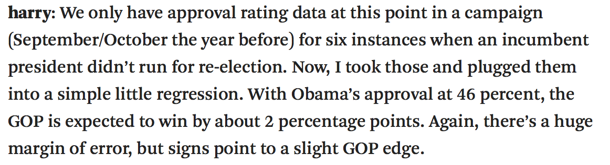

```{r setup, include=FALSE}
library(knitr)
options(digits=3)
knitr::opts_chunk$set(echo = TRUE)
library(dplyr)
library(ggplot2)
library(oilabs)
library(openintro)
```

## 
<center>

</center>


## Estimating $\beta_1$ {.build}

```{r find-b1, echo = FALSE}
poverty <- read.delim("../poverty.txt", header = TRUE)
library(ggplot2)
(p1 <- ggplot(poverty, aes(Poverty, Graduates)) + 
  xlim(0, 20) +
  ylim(75, 96) +
  geom_point())
```

We use $s_x, s_y, \textrm{ and } R$ to calculate $b_1$.


## Estimating $\beta_1$ {.build}

```{r find-b1-2, echo = FALSE}
m1 <- lm(Graduates ~ Poverty, data = poverty)
(p2 <- p1 + 
   geom_abline(intercept = 93, slope = m1$coef[2], col = "goldenrod") +
   annotate("text", x = 3, y = 87, label = paste("slope = ", round(m1$coef[2], 2))))
```

We use $s_x, s_y, \textrm{ and } R$ to calculate $b_1$.


## Estimating $\beta_0$ {.build}

```{r find-b02, echo = FALSE}
x_bar <- mean(poverty$Poverty)
y_bar <- mean(poverty$Graduates)
p1 + 
  geom_vline(xintercept = mean(poverty$Poverty), 
                col = "steelblue",
                lty = 2) +
  geom_hline(yintercept = mean(poverty$Graduates), 
                col = "steelblue",
                lty = 2) + 
  geom_abline(intercept = m1$coef[1], slope = m1$coef[2], col = "goldenrod") +
  annotate("text", x = 3, y = 91, label = paste("slope = ", round(m1$coef[2], 2))) +
  annotate("text", x = 14, y = 96, label = paste("x-bar = ", round(x_bar, 2))) +
  annotate("text", x = 19, y = 85, label = paste("y-bar = ", round(y_bar, 2)))
```

If the line of best fit *must* pass through $(\bar{x}, \bar{y})$, what is $b_0$?


## Estimating $\beta_0$ {.build}

Since $(11.35, 86.01)$ is on the line, the following relationship holds.

$$ 86.01 = b_0 - 0.9 (11.35) $$

Then just solve for $b_0$.

$$ b_0 = 86.01 + 0.9 (11.35) = 96.22$$

More generally:

$$ b_0 = \bar{y} - b_1 \bar{x} $$


## Estimation in R {.smaller .build}

```{r fitlm}
m1 <- lm(Graduates ~ Poverty, data = poverty)
summary(m1)
```


## The `lm` object {.build .smaller}

```{r showlm}
attributes(m1)
m1$coef
m1$fit
```


## Interpretation of $b_1$ {.build}

The **slope** describes the estimated difference in the $y$ variable if the explanatory
variable $x$ for a case happened to be one unit larger.

```{r}
m1$coef[2]
```

*For each additional percentage point of people living below the poverty level,
we expect a state to have a proprotion of high school graduates that is 0.898
lower*.

**Be Cautious**: if it is observational data, you do not have evidence of a 
*causal link*, but of an association, which still can be used for prediction.


## Interpretation of $b_0$ {.build}

The **intercept** is the estimated $y$ value that will be taken by a case with 
an $x$ value of zero.

```{r}
m1$coef[1]
```

While necessary for prediction, the intercept often has no meaningful interpretation.

# Some chatter from the internets

## 2016 Election {.build}
<center>

</center>

**Question at hand**: How will Obama's 46% approval rating effect his
party's candidate for the 2016 presidential election?


## 
<center>

</center>


##  {.build}
<center>

</center>

</br>
</br>

### How would you visualize this data?

##  {.build}
<center>

</center>

</br>

### Why is it ridiculous?


## Inference for Regression {.build}
We can fit a line through any cloud of points that we please, but if we
just have a *sample* of data, any trend we detect doesn't necessarily 
demonstrate that the trend exists in the *population* at large.


## Plato's Allegory of the Cave

<div class="centered">

</div>


## Statistical Inference {.build}

**Goal**: use *statistics* calculated from data to makes inferences about the 
nature of *parameters*.

In regression,

- parameters: $\beta_0$, $\beta_1$
- statistics: $b_0$, $b_1$

Classical tools of inference:

- Confidence Intervals
- Hypothesis Tests


## Unemployment and elections {.build}
```{r echo = FALSE}
library(openintro)
data(unempl)
data(house)
data(president); pres <- president
year   <- seq(1898, 2010, 4)+1
n      <- length(year)
unemp  <- rep(0, n)
change <- rep(0, n)
presid <- rep("", n)
party  <- rep("", n)
for(i in 1:n){
	urow <- which(unempl$year == year[i]-1)
	if(i < n){
		prow <- which(pres$end > year[i])[1]
	} else {
		prow <- which(pres$potus == "Barack Obama")
	}
	hrow <- which(house$yearEnd >= year[i])[1]
	party[i] <- as.character(pres$party[prow])
	if(substr(house$p1[hrow],1,5) == substr(party[i],1,5)){
		oldHouse <- house$np1[hrow] / house$seats[hrow]
	} else {
		oldHouse <- house$np2[hrow] / house$seats[hrow]
	}
	if(substr(house$p1[hrow+1],1,5) == substr(party[i],1,5)){
		newHouse <- house$np1[hrow+1] / house$seats[hrow+1]
	} else {
		newHouse <- house$np2[hrow+1] / house$seats[hrow+1]
	}
	change[i] <- (newHouse - oldHouse)/oldHouse * 100
	presid[i] <- as.character(pres$potus[prow])
	unemp[i]  <- unempl$unemp[urow]
}

unemployPres <- data.frame(year=year, potus=presid, party=party, unemp=unemp, change=change)
unemployPres[29, 3] <- "Democratic"
```

```{r echo = FALSE}
levels(unemployPres$party) <- levels(unemployPres$party)[c(1, 3, 2)]
levels(unemployPres$party)[2:3] <- c("Dem", "Rep")
qplot(x = unemp, y = change, col = party, data = unemployPres)
```

**Reigning theory**: voters will punish candidates from the Presidents party
at the ballot box when unemployment is high.


## Unemployment and elections

```{r echo=FALSE}
m1 <- lm(change ~ unemp, data = unemployPres)
qplot(x = unemp, y = change, col = party, data = unemployPres) +
  geom_abline(intercept = m1$coef[1], slope = m1$coef[2])
```

**Reigning theory**: voters will punish candidates from the Presidents party
at the ballot box when unemployment is high.


## Unemployment and elections {.build}

```{r echo = FALSE}
library(dplyr)
ump <- filter(unemployPres, unemp < 15)
m0 <- lm(change ~ unemp, data = ump)
qplot(x = unemp, y = change, col = party, data = ump) +
  geom_abline(intercept = m0$coef[1], slope = m0$coef[2])
```

Some evidence of a negative linear relationship between unemployment level
and change in party support - or is there?


## H-test for Regression {.build}

$H_0:$ There is no relationship between unemployment level and change in 
party support.

$H_O: \beta_1 = 0$

### Method
If there is no relationship, the pairing between $X$ and $Y$ is
artificial and we can randomize:

1. Create synthetic data sets under $H_0$ by shuffling $X$.
2. Compute a new regression line for each data set and store each $b_1$.
3. See where your observed $b_1$ falls in the distribution of $b_1$'s under $H_0$.


##

```{r echo = FALSE}
set.seed(764)
ump_shuffled <- ump
```

```{r}
ump_shuffled$unemp <- sample(ump_shuffled$unemp)
qplot(x = unemp, y = change, col = party, data = ump_shuffled)
```

## First $b_1$

```{r echo = FALSE}
m1 <- lm(change ~ unemp, data = ump_shuffled)
qplot(x = unemp, y = change, col = party, data = ump_shuffled) +
  geom_abline(intercept = m1$coef[1], slope = m1$coef[2])
```


## Second $b_1$

```{r, echo = FALSE}
ump_shuffled$unemp <- sample(ump$unemp)
m1 <- lm(change ~ unemp, data = ump_shuffled)
qplot(x = unemp, y = change, col = party, data = ump) +
  geom_abline(intercept = m1$coef[1], slope = m1$coef[2])
```


## 100 $b_1$'s

```{r echo = FALSE, cache=TRUE}
line_df <- data.frame(matrix(rep(0, 200), ncol = 2))
for (i in 1:100) {
  ump_shuffled$unemp <- sample(ump$unemp)
  m1 <- lm(change ~ unemp, data = ump_shuffled)
  line_df[i, ] <- c(m1$coef)
}

p <- qplot(x = unemp, y = change, col = party, data = ump)

for (i in 1:100) {
  p <- p + geom_abline(intercept = line_df[i, 1], slope = line_df[i, 2],
                       alpha = .3)
}

p
```


## Sampling dist. of $b_1$

```{r echo = FALSE, message = FALSE}
qplot(line_df[, 2], geom = "density") + 
  geom_vline(xintercept = m0$coef[2], col = "tomato")
```


## H-tests for regression {.smaller}

```{r}
m0 <- lm(change ~ unemp, data = ump)
summary(m0)
```


## H-tests for regression {.smaller .build}
- Each line in the summary table is a hypothesis test that the parameter is zero.
- Under certain conditions, the test statistic associated with $b$'s is distributed 
like $t$ random variables with $n - p$ degrees of freedom.

$$ \frac{b - \beta}{SE} \sim t_{df = n - p}$$

```{r}
t_stat <- (-1.0010 - 0)/0.8717
pt(t_stat, df = 27 - 2) * 2
```


## Conditions for inference

1. **Linearity**: linear trend between $X$ and $Y$, check with residual plot.
2. **Independent errors**: check with residual plot for serial correlation.
3. **Normally distributed errors**: check for linearity in qq-plot.
4. **Errors with constant variance**: look for constant spread in residual plot.


##  {.build}
<center>

</center>

