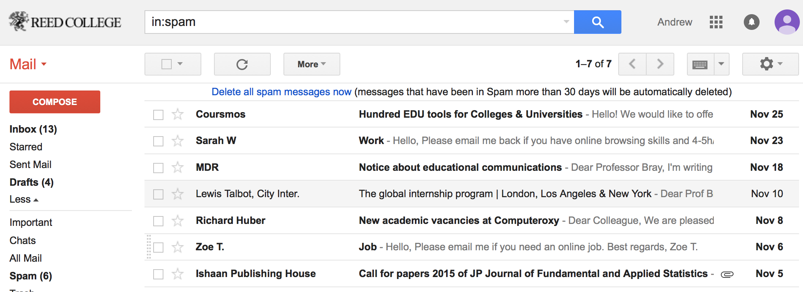

```{r setup, include=FALSE}
library(knitr)
options(digits=3)
knitr::opts_chunk$set(echo = TRUE, fig.align = "center")
library(dplyr)
library(ggplot2)
library(oilabs)
library(openintro)
```

## Building a spam filter {.build .smaller}

```{r}
head(email)
# where did this data come from / how was it collected?
```


## How was the data collected? {.flexbox .vcenter .build}



1. Choose a single email account
2. Save each email that comes in during a given time frame
3. Create dummy variables for each text component of interest
4. Visually classify each as spam or not


## Simple Filter A {.build}

Predicting spam or not using the presence of "winner"

```{r echo = FALSE, fig.width=5, fig.height = 4}
#qplot(x = winner, fill = factor(spam), data = email, geom = "bar", 
 #     position = "fill", ylab = "proportion")
ggplot(email, aes(x = winner, fill = factor(spam))) +
  geom_bar(position ="fill")
```

If "winner" then "spam"?


## Simple Filter B {.build}

Predicting spam or not using number of characters (in K)

```{r echo = FALSE, fig.width=6, fig.height = 4}
qplot(x = num_char, col = factor(spam), data = email, geom = "density")
```


## Simple Filter B {.build}

Predicting spam or not using log number of characters (in K)

```{r echo = FALSE, fig.width=6, fig.height = 4}
qplot(x = log(num_char), col = factor(spam), data = email, geom = "density")
```

If `log(num_char)` < 1, then "spam"?


## Challenges {.build}

Each simple filter can be thought of as a regression model.

### Filter A
$spam \sim winner; \quad G_1 \sim G_2$

### Filter B
$spam \sim log(num\_char); \quad G_1 \sim K_1$

Each one by itself has poor predictive power, so how can we combine them into
a single stronger model?


## {.flexbox .vcenter .build}


#

## Logistic Regression for B {.flexbox .vcenter}

$$spam \sim log(num\_char)$$

```{r echo = FALSE, eval = TRUE, message = FALSE, fig.width=6, fig.height = 4}
library(dplyr)
email <- mutate(email, log_num_char = log(num_char))
qplot(x = log_num_char, y = spam, data = email, 
      geom = "point", alpha = I(.1), ylab = "spam") +
  stat_smooth(method = "glm", method.args = list(family = "binomial"),
              se = FALSE)
```


##
```{r}
m1 <- glm(spam ~ log(num_char), data = email, family = "binomial")
summary(m1)
```


## Interpreting Log. Reg. {.build}
1. Each row of the summary output is still a H-test on that parameter being 0.
2. A positive slope estimate indicates that there is a positive association.
3. Each estimate is still conditional on the other variables held constant.


## A more sophisticated model {.build .smaller}

```{r}
m2 <- glm(spam ~ log(num_char) + to_multiple + attach + dollar + inherit + 
            viagra, data = email, family = "binomial")
summary(m2)
```


## Extending the model {.build}

A GLM consists of three things:

1. A linear predictor
2. A distribution of the response
3. A link function between the two

### MLR
Normal distribution, identity link function

### Logisitic Regression
Binomial distribution, logit link function

### Poisson Regression
Poisson distribution, logarithm
